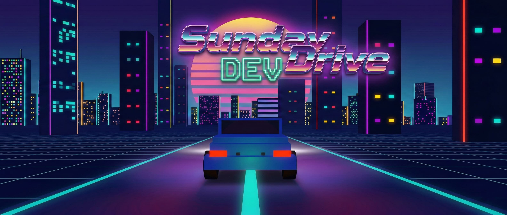
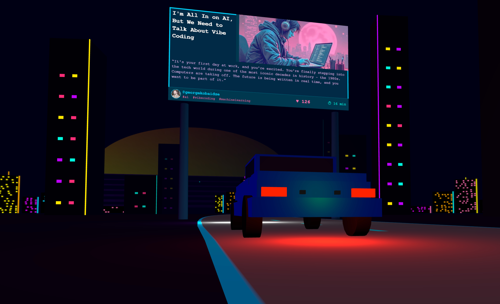
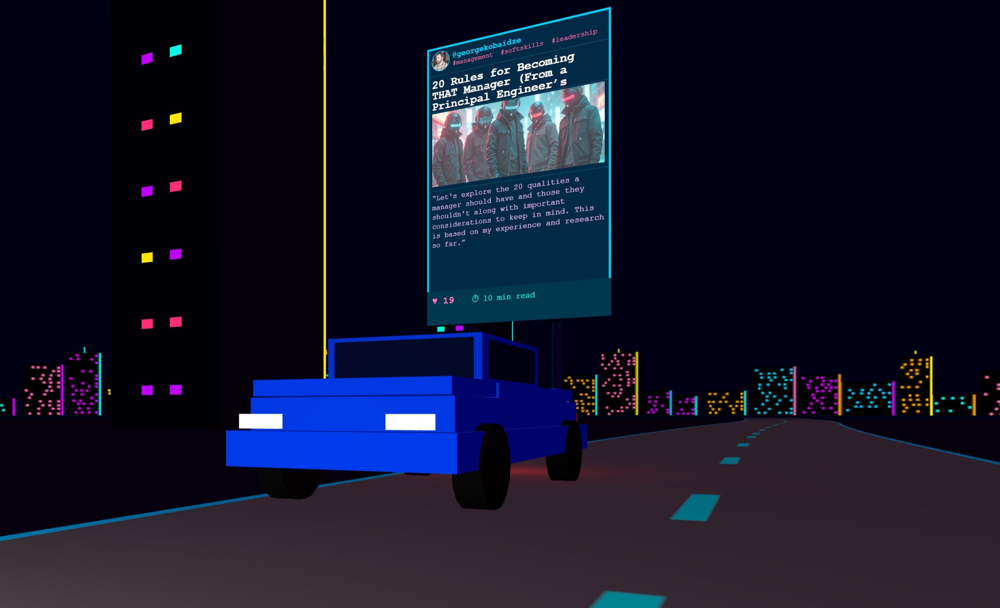
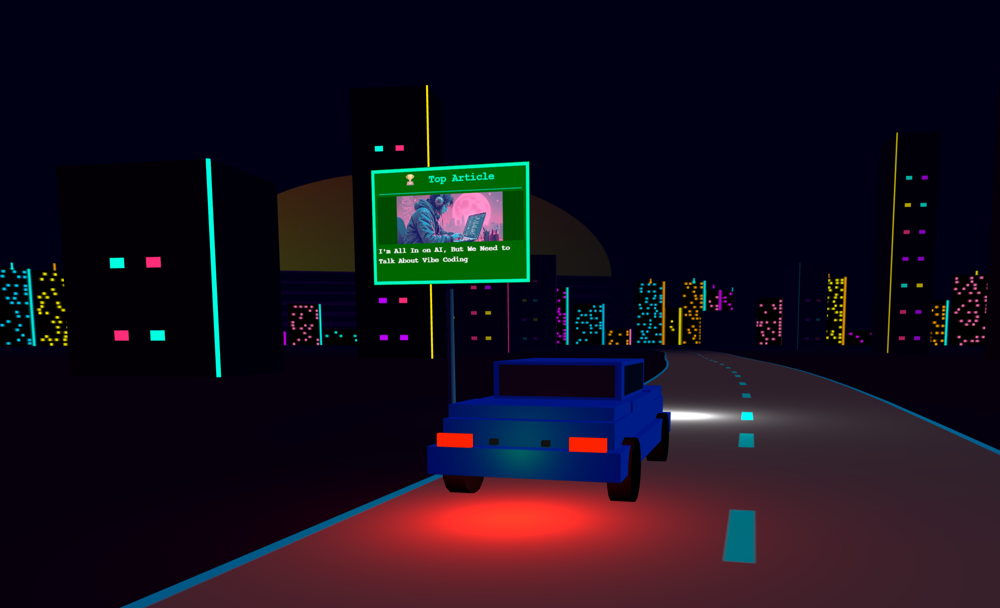
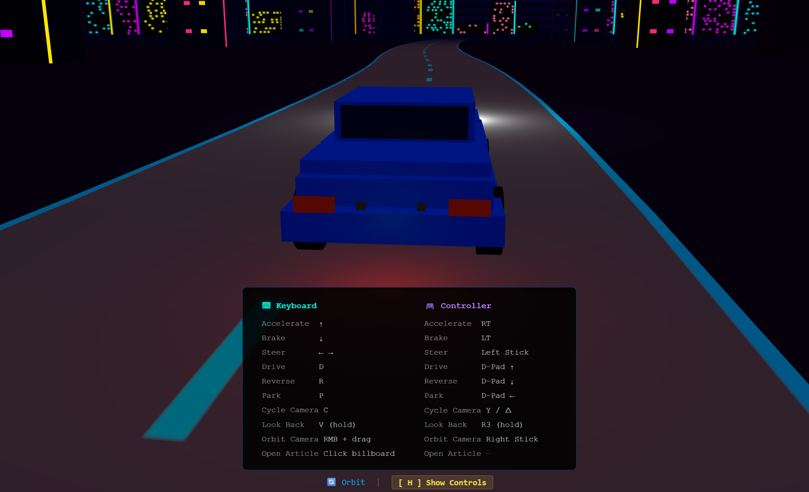

# Sunday DEV Drive

A synthwave driving experience through your DEV Community articles.

## Live Demo

<!-- 🔗 **[Live Demo](TODO)** -->



## About

Enter your [DEV Community](https://dev.to) username, hit **Start Driving**, and cruise through a neon-lit synthwave world where your articles appear as roadside billboards. Each billboard shows a title, cover image, and a snippet from the article body. Click any to open the full post.

Built for the [DEV Weekend Challenge: Build for Your Community](https://dev.to/challenges/weekend-2026-02-28).

## Features

### Your Articles as Billboards

Roadside and overhead signs generated from your real DEV posts, complete with cover images, snippets, and reaction counts.




### Stat Signs Along the Road

Green road signs display your profile stats: total articles, reactions, reading time, top post, favorite tags, and join date.



### Keyboard & gamepad support

Drive with arrow keys or plug in a controller. Full analog steering, throttle, and a right-stick orbit camera.



### Gears & car physics

Shift between Park, Drive, and Reverse. Acceleration, braking, friction, off-road drag, it all feels right.

### Multiple camera modes

Chase cam, interior cockpit, side view, and free orbit. Press V to look back.

### Synthwave aesthetics

Neon city skyline, gradient sun, glowing grid ground, and a retro pixel-art car with working headlights and brake lights.

### Three play modes
- **Your articles (for community members):** Enter a username to drive through their posts
- **Motivational mode (for community members with no articles):** Users with no articles see encouraging messages with links to start writing
- **Test drive (for non-members of the community):** No DEV account? Take a demo spin anyway and let the game will try to convince you to join the DEV Community

### Shareable journeys

Share a link that drops someone right into your article highway.

## Controls

| Action           | Keyboard         | Gamepad     |
| ---------------- | ---------------- | ----------- |
| Throttle / Brake | ↑ / ↓            | RT / LT     |
| Steer            | ← →              | Left Stick  |
| Drive gear       | D                | D-Pad Up    |
| Reverse gear     | R                | D-Pad Down  |
| Park             | P                | D-Pad Left  |
| Cycle camera     | C                | Y           |
| Look back        | V                | B           |
| Orbit camera     | RMB + Mouse Drag | Right Stick |
| Toggle help      | H                | —           |

## How It Works

1. Fetches your articles from the [DEV API](https://developers.forem.com/api/v1) (public, no auth needed)
2. Picks 25 random articles and loads full content for snippet extraction
3. Generates billboard textures on canvas: titles, covers, quotes from your writing
4. Places them along a procedurally generated road that extends as you drive
5. All rendering is done client-side with [Three.js](https://threejs.org/) — no backend required

## Tech Stack

- **Three.js** (r170): 3D rendering, loaded via import maps from CDN
- **Vanilla JavaScript**: ES modules, zero build step, zero dependencies
- **Canvas API**: Dynamic billboard and sign texture generation
- **DEV API**: Article and user data (public endpoints, no API key)

## Project Structure

```
├── index.html              # Entry point
├── styles/main.css         # All styles
├── assets/                 # Favicon, poster image
└── src/
    ├── main.js             # Animate loop, physics, event wiring
    ├── scene.js            # Renderer, camera, lights, skyline, ground
    ├── road.js             # Procedural path & road mesh
    ├── car.js              # Car model, gears, headlights
    ├── camera.js           # Chase/interior/side/orbit cameras
    ├── buildings.js        # Neon building strips
    ├── billboards.js       # Article billboard pool & textures
    ├── stats.js            # Stat road signs & welcome banner
    ├── api.js              # DEV API integration & demo mode
    ├── input.js            # Keyboard & gamepad input
    ├── ui.js               # DOM elements & HUD
    └── messages.js         # Motivational & demo messages
```

## Running Locally

Serve the project root with any static file server:

```bash
npx serve .
```

No build step, no `npm install` — just open and drive.

## License

MIT